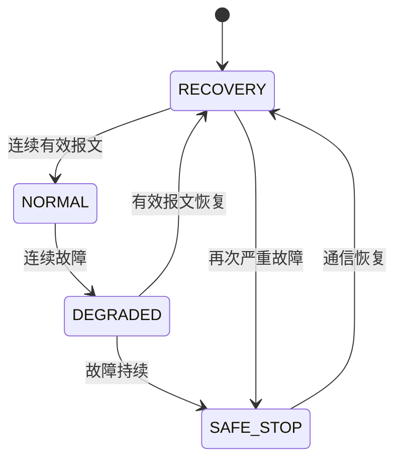
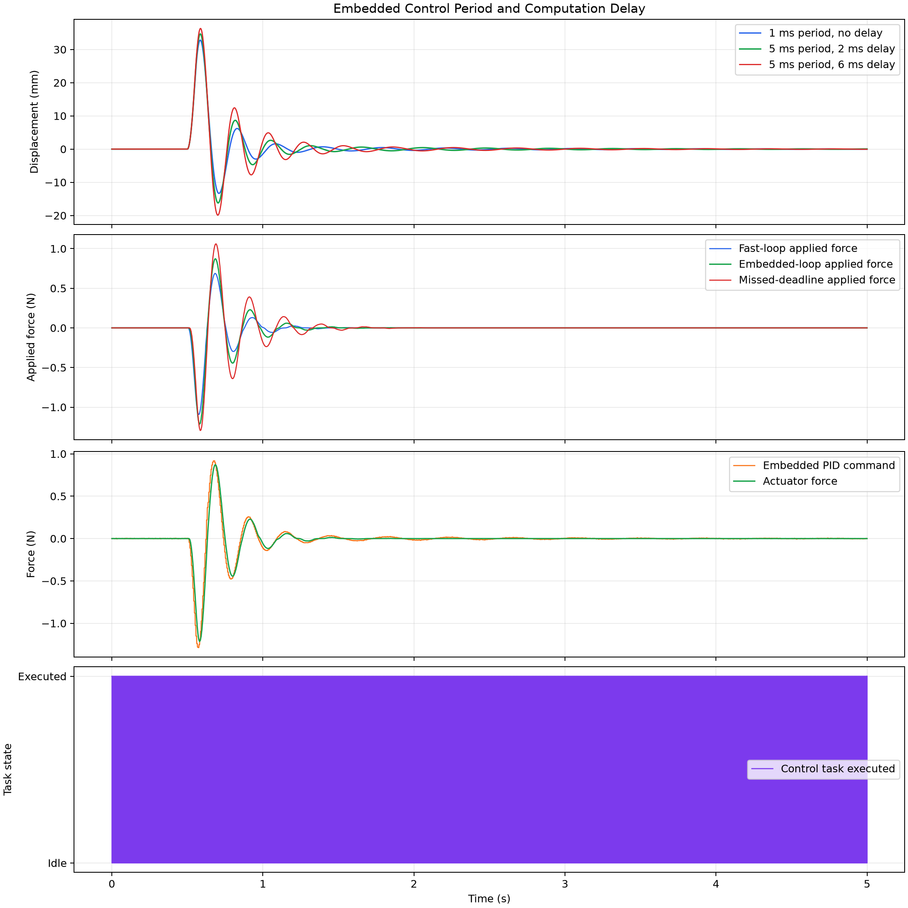
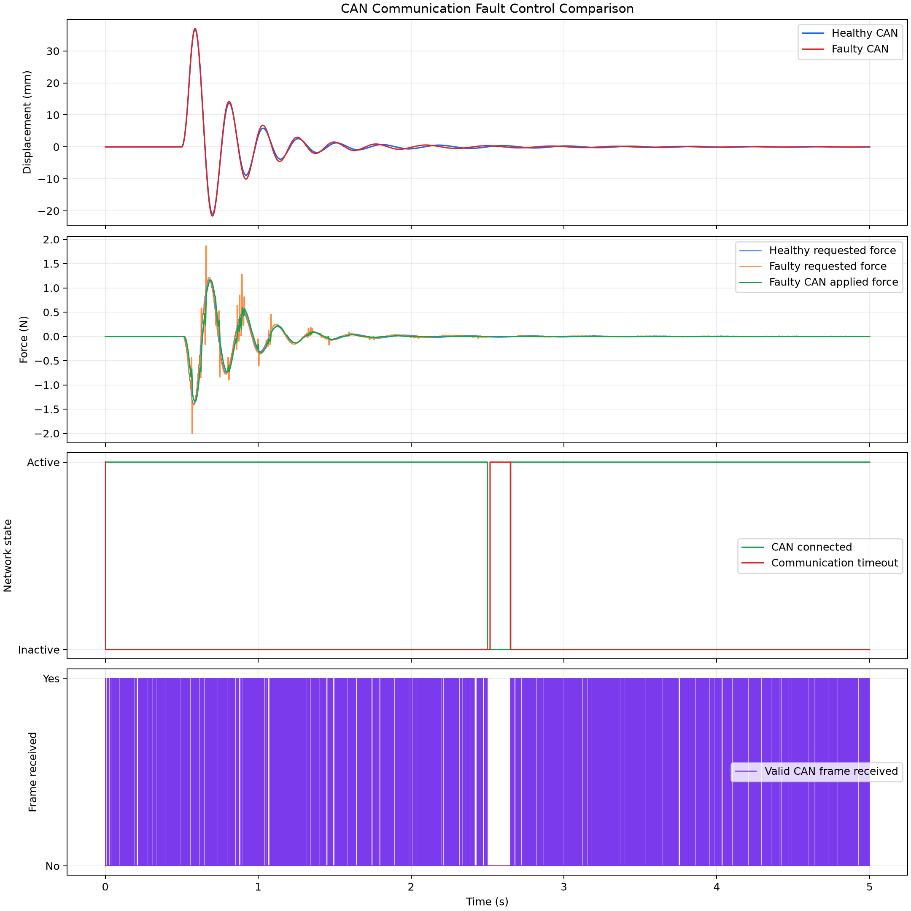
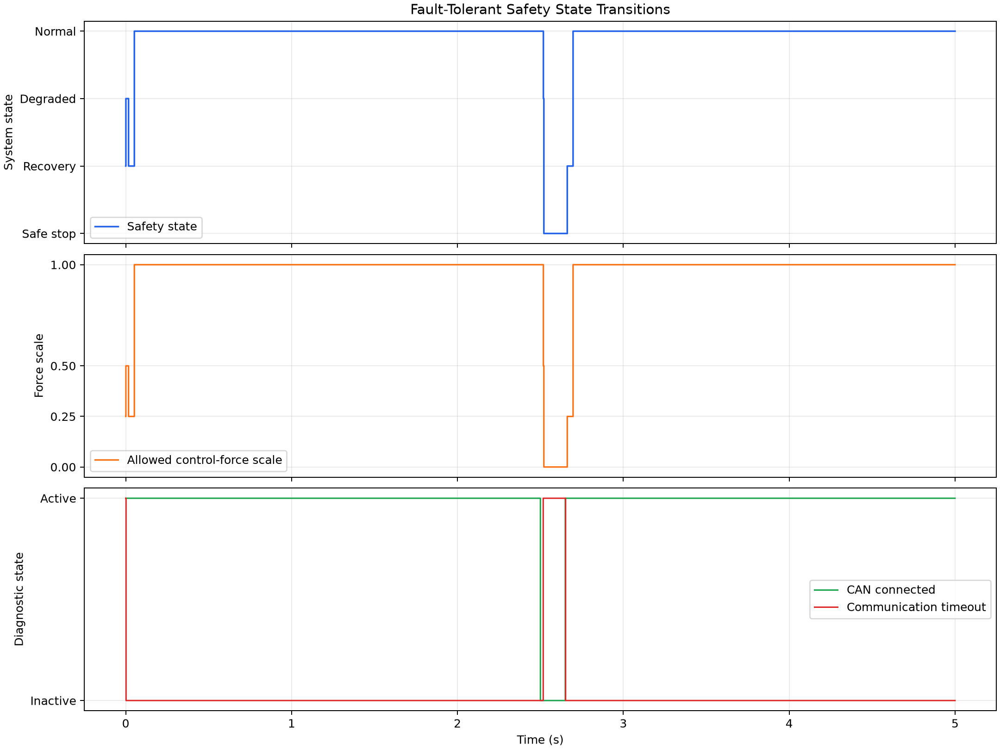

# Flexible Beam Controller-in-the-Loop Platform
[](https://github.com/yiliuzi/flexible-beam-controller-in-the-loop/actions/workflows/ci.yml)


一个无需真实硬件即可运行的柔性梁嵌入式控制器在环仿真平台。

项目以柔性梁振动抑制为控制对象，在计算机上模拟完整的嵌入式闭环系统，包括动力学对象、虚拟传感器、状态观测器、PID控制器、音圈执行器、周期控制任务、CAN通信故障和故障安全状态机。

## 项目特点

- 使用动力学方程模拟柔性梁振动响应
- 支持冲击、正弦和随机外部扰动
- 实现带抗积分饱和的PID控制器
- 使用Luenberger观测器估计位移与速度
- 模拟传感器噪声、零偏、量化、饱和和丢包
- 模拟音圈执行器死区、限幅和一阶响应延迟
- 模拟MCU周期控制任务、零阶保持和计算延迟
- 实现8字节CAN状态报文及CRC-8校验
- 支持CAN延迟、随机丢包、数据损坏和总线断连
- 实现正常、降级、安全停机和恢复状态机
- 支持自动化实验、CSV数据导出和结果绘图
- 自动化测试覆盖率达到95%
- 无需开发板或其他实体硬件

## 系统架构


## 安全状态机



| 状态 | 执行器策略 | 控制力比例 |
|---|---|---:|
| NORMAL | 正常控制 | 100% |
| DEGRADED | 降级控制 | 50% |
| RECOVERY | 受限恢复 | 25% |
| SAFE_STOP | 禁用执行器 | 0% |

## 技术栈

- Python 3.13
- NumPy
- Pandas
- Matplotlib
- Pytest
- pytest-cov
- Ruff
- PowerShell
- Git

## 项目结构

```text
flexible-beam-controller-in-the-loop/
├── actuators/          # 音圈执行器模型
├── communication/      # CAN协议和虚拟CAN总线
├── controllers/        # PID控制器和状态观测器
├── embedded/           # MCU周期任务与计算延迟
├── experiments/        # 系统级对比实验
├── plant/              # 柔性梁动力学模型
├── safety/             # 故障安全状态机
├── sensors/            # 虚拟位移传感器和IMU
├── simulation/         # 固定步长仿真运行器
├── visualization/      # 实验结果可视化
├── tests/              # 单元测试和集成测试
├── scripts/            # 一键质量门禁脚本
├── data/               # 实验CSV数据
├── results/            # 实验结果图片
├── reports/            # 测试覆盖率报告
├── pyproject.toml
├── requirements.txt
└── README.md
```

## 快速开始

### 1. 创建虚拟环境

```powershell
python -m venv .venv
```

```powershell
.\.venv\Scripts\Activate.ps1
```

### 2. 安装依赖

```powershell
python -m pip install --upgrade pip
```

```powershell
python -m pip install -r requirements.txt
```

### 3. 运行全部测试

```powershell
python -m pytest -v
```

### 4. 运行质量门禁

```powershell
powershell `
    -ExecutionPolicy Bypass `
    -File .\scripts\run_quality_gate.ps1
```

质量门禁包含：

- Ruff静态检查
- Ruff格式检查
- 全量自动化测试
- 90%最低覆盖率门槛
- 嵌入式时序实验
- CAN故障安全实验
- 结果文件完整性检查

## 运行主要实验

### 状态观测器PID实验

```powershell
python -m experiments.observer_pid_control
```

### 非理想音圈执行器实验

```powershell
python -m experiments.actuator_pid_control
```

### 嵌入式实时任务实验

```powershell
python -m experiments.embedded_timing_control
```

### CAN通信故障与安全控制实验

```powershell
python -m experiments.can_fault_control
```

## 实验结果

### 嵌入式任务时序影响

| 控制模式 | 位移RMS | 相对性能损失 |
|---|---:|---:|
| 1 ms周期、无计算延迟 | 4.3151 mm | 基准 |
| 5 ms周期、2 ms计算延迟 | 4.6425 mm | 7.59% |
| 5 ms周期、6 ms计算延迟 | 5.1259 mm | 18.79% |

结果说明，控制周期增大和任务计算延迟会降低振动抑制性能，持续超过任务截止期会产生更明显的性能退化。



### CAN通信故障影响

| 指标 | 健康CAN | 故障CAN |
|---|---:|---:|
| 位移RMS | 5.2922 mm | 5.4085 mm |
| 发送帧数 | 1001 | 1001 |
| 丢弃帧数 | 0 | 92 |
| CRC损坏帧数 | 0 | 40 |
| CRC拒绝帧数 | 0 | 40 |
| 检测到的丢帧数 | 0 | 132 |
| 通信超时采样数 | 2 | 137 |

故障CAN实验使用固定随机种子，可稳定复现随机丢包、CRC损坏和总线断连结果。



### 故障安全状态切换

故障场景下记录到：

- NORMAL：4770个采样点
- DEGRADED：19个采样点
- SAFE_STOP：141个采样点
- RECOVERY：71个采样点
- 状态切换：7次



### 测试覆盖率

项目核心模块自动化测试覆盖率为95%，并在质量门禁中设置90%的最低覆盖率要求。

```text
Statements: 844
Missing:     46
Coverage:    95%
```

覆盖率报告生成位置：

```text
reports/coverage/index.html
```

## CAN状态报文

项目使用8字节经典CAN负载：

| 字节 | 内容 |
|---|---|
| 0–1 | 位移信号，有符号16位整数 |
| 2–3 | 速度信号，有符号16位整数 |
| 4 | 帧序号 |
| 5 | 状态标志位 |
| 6 | 协议版本 |
| 7 | CRC-8校验值 |

状态标志位包含：

- 测量有效
- 传感器故障
- 执行器饱和
- 控制任务截止期超时

## 故障注入能力

虚拟CAN总线支持：

- 固定通信延迟
- 随机丢包
- 随机位翻转
- CRC错误检测
- 报文序号丢帧统计
- 总线主动断连
- 通信超时检测
- 固定随机种子复现

## 工程价值

该项目将控制算法与嵌入式软件工程结合，可用于展示以下能力：

- 控制对象建模和离散仿真
- PID控制与状态观测器设计
- 传感器与执行器非理想特性建模
- 实时周期任务和截止期分析
- CAN通信协议设计
- CRC与报文序号诊断
- 故障注入和容错控制
- 安全状态机设计
- 单元测试、集成测试和覆盖率管理
- 数据分析和实验结果可视化

## 后续硬件扩展

当前项目可以在无硬件条件下完整运行。后续可接入：

- STM32或ESP32控制器
- CAN收发器
- 位移传感器或IMU
- 音圈电机驱动器
- 实际柔性梁实验平台

软件中的PID、CAN协议、安全状态机和测试结构可继续复用于真实硬件系统。

## License

This project is intended for learning, research and portfolio demonstration.